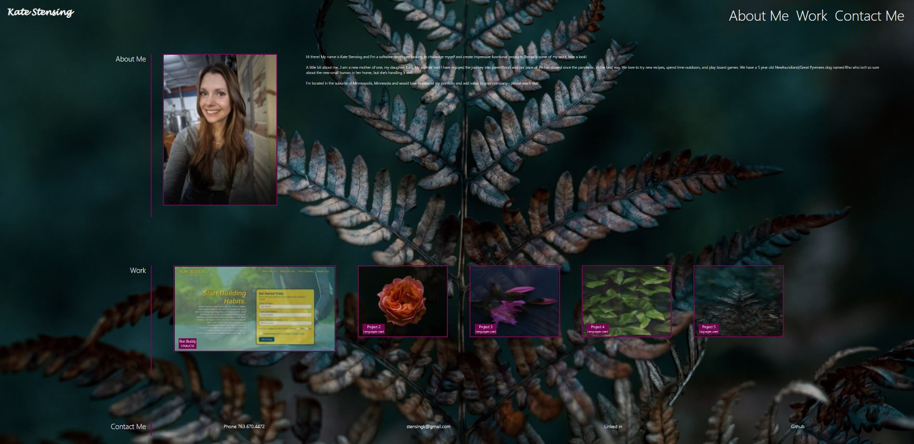

# Kate Stensing's Development Portfolio  

## This webpage was created using HTML and CSS.

This portfolio page is intended to provide a little bit about me, my previous works, and my contact information. Select a topic from the upper navigation and you will be brought to the corresponding section on the page.  Please select a work tile to be taken to the appropriate project. Enjoy!

## Table of Contents

* [Installation](#installation)
* [Usage](#usage)
* [Credits](#credits)

## Installation

Click this [LINK](https://kstensing.github.io/portfolio/) for the landing page.

## Usage

The landing page should resemble the image below: 

## Credits

### Photo Credits:

  

    

## License

Licensed under the [MIT](LICENSE.txt) license.

